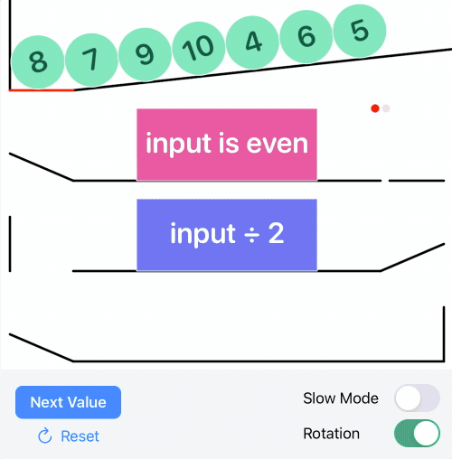

# Functional Programming With Physics
This playground received a Swift Student Challenge 2021 Award. It introduces functional pipline concepts (`map` and `filter`) using a Rube Goldberg-inspired physics simulation. It also provides an easy API for you to create your own pipeline simulations.

### Demo
We can simulate this pipeline:
```swift
[8, 7, 9, 10, 4, 6, 5]
    .filter { $0.isMultiple(of: 2) }
    .map { $0 / 2 }
```

By executing the following code in the playground:
```swift
PlaygroundPage.current.setLiveView(
    Simulation(
        source: [8, 7, 9, 10, 4, 6, 5],
        pipeline: [
            Filter(expression: "input is even"),
            Map(expression: "input ÷ 2")
        ]
    )
)
```

Which generates the following user-controlled simulation:  


### API Notes
`Simulation` can be initialised with any integer sequence, so the following is valid:
```swift
Simulation(source: 1...10, pipeline: /*...*/)
```

Some example expressions you can use:
```swift
PlaygroundPage.current.setLiveView(
    Simulation(
        source: /*...*/,
        pipeline: [
            Filter(expression: "input is odd"),
            Filter(expression: "input is prime"),
            Filter(expression: "input is negative"),
            Filter(expression: "input ≠ 5"),
            Filter(expression: "input is square")
        ]
    )
)
```

### Acknowledgements
[Expression](https://github.com/nicklockwood/Expression) by Nick Lockwood helps keep the simulation API easy to use.
